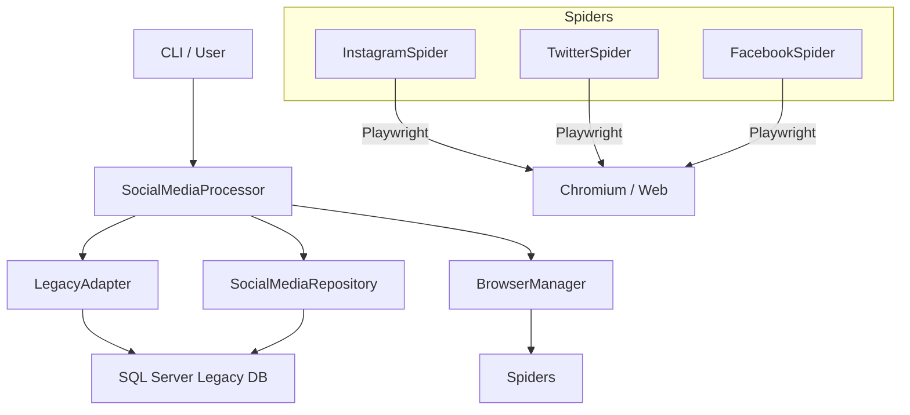

# 🤖 Processador de Mídias Sociais (Moderno)

Solução robusta para automação de captura, scraping e processamento de links de mídias sociais, integrada a um banco de dados SQL Server e com suporte a sistemas legados.

---

## 🏗️ Arquitetura do Sistema

O sistema é construído em Python 3.12+, utilizando um padrão de camadas para separar responsabilidades:



- **CLI (`cli.py`)**: Interface de linha de comando para interação com o usuário.
- **Service Layer (`src/services`)**: Orquestra o fluxo de trabalho (Scraping -> OCR/Extração -> Legado).
- **Spiders (`src/scraper/spiders`)**: Motores baseados em Playwright especializados em burlar detecções e extrair conteúdo.
- **Repository (`src/database`)**: Gerencia toda a persistência de dados e status dos links.
- **Legacy Adapter (`src/legacy_adapter`)**: Ponte de compatibilidade que executa binários legados em C# para processamento final.

---

## ✨ Funcionalidades Principais

- **Twitter/X**: Detecção resiliente de tweets e contas inexistentes (erro 404), interrompendo retries desnecessários.
- **Instagram**: Conversão inteligente de layout de **Reels** para **Posts** (`/p/`) para garantir capturas visuais estáveis.
- **Facebook**: Captura de conteúdo em modais e detecção automática de postagens indisponíveis.
- **Gestão de Fila**: Filtra links pendentes por plataforma e prioriza registros mais recentes (últimos 15 dias).
- **Persistência de Sessão**: Mantém login ativo sem necessidade de interação constante, usando estados serializados em JSON.

---

## 🛠️ Instalação e Requisitos

### Pré-requisitos
- **Python 3.12** ou superior.
- **SQL Server** com Driver ODBC 17 ou 18 instalado.
- **UV** (opcional, recomendado para gestão de pacotes).

### Instalação Rápida
1. Clone o repositório.
2. Instale as dependências:
   ```bash
   pip install -r requirements.txt
   ```
3. Instale os navegadores do Playwright:
   ```bash
   playwright install chromium
   ```

### Configuração (`.env`)
Crie um arquivo `.env` na raiz do projeto seguindo este modelo:
```env
# Banco de Dados
DB_SERVER=SEU_SERVIDOR
DB_DATABASE=NOME_BANCO
DB_USER=USUARIO
DB_PASSWORD=SENHA

# Configurações de Scraping
HEADLESS=True

# Credenciais (Opcional se usar manual_login.py primeiro)
TWITTER_USER=...
TWITTER_PASS=...
INSTAGRAM_USER=...
INSTAGRAM_PASS=...
FACEBOOK_USER=...
FACEBOOK_PASS=...
```

---

## 🚀 Guia de Uso (CLI)

O arquivo `cli.py` é o seu centro de comando.

### 📋 Visualizar Fila
Veja o que está pendente no banco de dados:
```bash
python cli.py queue --limit 50 --platform instagram
```

### ⚙️ Iniciar Processamento
Processar um lote de 10 links do Twitter:
```bash
python cli.py process --batch --limit 10 --platform twitter
```

Processar um ID específico manualmente:
```bash
python cli.py process --id 1234567
```

### 🔄 Resetar Status
Se um link falhou e você quer que ele volte para a fila (status 1):
```bash
python cli.py reset --id 1234567
```

---

## 📊 Referência de Status (LIMW_IN_STATUS)

| Código | Descrição | Comportamento do Sistema |
| :--- | :--- | :--- |
| **1** | **Pendente** | Disponível para o comando `--batch`. |
| **2** | **Sucesso** | Captura concluída e enviada ao legado. |
| **3** | **Erro Crítico / 404** | O sistema não tentará processar novamente (Página sumiu). |
| **4** | **Duplicidade** | Se o link ja foi processado, ele não será processado novamente. |
| **9** | **Aguardando Retry** | Ocorreu um erro temporário; será tentado novamente. |

---

## 🔒 Gestão de Sessões e Login

Se as capturas começarem a falhar por falta de login ou o Instagram solicitar desafio:
1. Execute: `python manual_login.py`.
2. O navegador abrirá em modo visível. Realize o login manualmente.
3. Feche o navegador. O arquivo `instagram_state.json` (ou correspondente) será atualizado com os novos cookies.

---

## 📁 Estrutura de Pastas

- `captures/`: Armazena temporariamente as imagens (.png) e textos (.txt) extraídos.
- `src/utils/`: Utilitários de logging e limpeza visual de páginas.
- `src/scraper/core/`: Configuração robusta do browser (Stealth Mode, Viewports).
